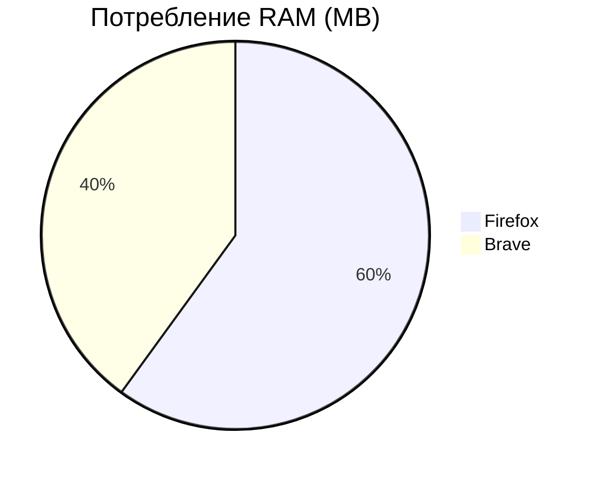
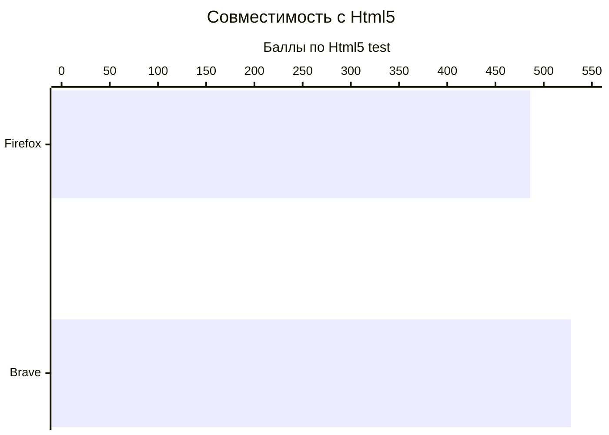

# Детальный отчет(Для разработчиков)
Критерий                  |Firefox     |Brave  |
--------------------------|------------|-------|
Потребление RAM           |1.8 Gb      |1.4 Gb |
Html5 совместимость       |486/555     |528/555|
Безопасность(Tranco.list) |#868        |#644   |

# Потребление ОЗУ

# Html5 совместимость

